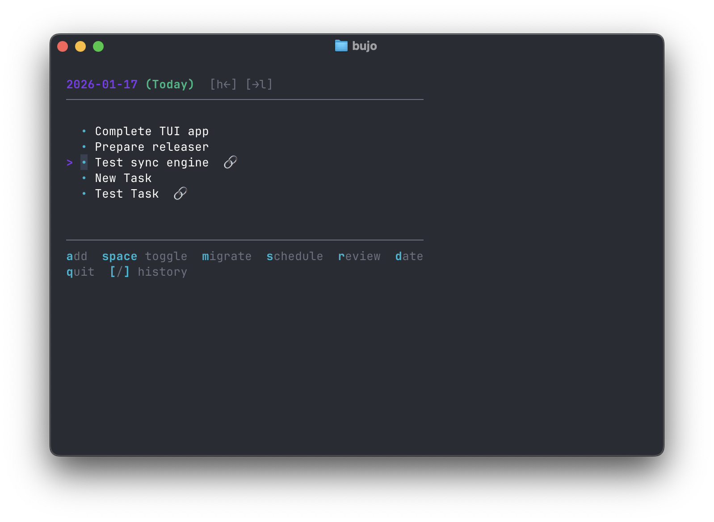

# bujo

**Terminal-based Bullet Journal for developers**

[](https://github.com/samakintunde/bujo/actions/workflows/release.yml) -blue>) 

`bujo` is a minimalist, terminal-based Bullet Journaling tool designed for developers who value speed, intentionality, and the "File over App" philosophy. It allows you to manage your daily tasks, events, and notes without ever leaving your terminal.



## Philosophy

- **Speed**: Capture thoughts and tasks instantly via the CLI.
- **Local-first (Markdown files)**: Your data lives in plain Markdown files on your machine. No proprietary formats, no cloud lock-in.
- **Intentionality**: Built-in workflows for migrating tasks and reviewing stale items to keep you focused on what matters.

## Features

- **CLI Rapid Capture** — Add tasks, events, and notes instantly from your terminal
- **Interactive TUI** — Full-featured terminal interface built with [Bubble Tea](https://github.com/charmbracelet/bubbletea)
- **Task Migration** — Move incomplete tasks forward to today with a single keypress
- **Task Scheduling** — Schedule tasks for specific future dates
- **Status Cycling** — Toggle tasks between Open → Done → Cancelled states
- **Daily Log Navigation** — Browse through your journal by date with `h`/`l` keys
- **Review Mode** — Process stale/overdue tasks with guided prompts
- **Date-based Organization** — Entries stored in `YYYY/MM/YYYY-MM-DD.md` format
- **SQLite Index** — Fast queries powered by an ephemeral SQLite database
- **Plain Markdown** — Human-readable files you can edit with any text editor
- **Zero Config** — Works out of the box with sensible defaults

## Installation

### Homebrew (macOS/Linux)

```bash
brew install samakintunde/tap/bujo
```

### Go

```bash
go install github.com/samakintunde/bujo@latest
```

### Manual

Download the pre-compiled binaries for your platform from the [GitHub Releases](https://github.com/samakintunde/bujo/releases) page.

## Quick Start / Workflow

### 1. Capture (CLI)

Capture entries instantly from your shell. By default, entries are added to today's log as tasks.

```bash
# Add a task for today
bujo add "Finish the project documentation"

# Add an event
bujo add -t event "Sprint Planning at 2 PM"

# Add a note
bujo add -t note "Meeting ID: 123-456-789"
```

### 2. Plan (TUI)

Launch the interactive Terminal User Interface (TUI) to manage your day, migrate tasks, and review your progress.

```bash
bujo
```

## TUI Keybindings

| Key            | Action           | Description                                       |
| :------------- | :--------------- | :------------------------------------------------ |
| **Navigation** |                  |                                                   |
| `j` / `k`      | **Move Cursor**  | Select next/previous entry                        |
| `h` / `l`      | **Change Date**  | Navigate to previous/next day                     |
| `t`            | **Jump Today**   | Go straight to today's log                        |
| **Actions**    |                  |                                                   |
| `Space`        | **Toggle State** | Cycle: Open → Done → Cancelled → Open             |
| `a`            | **Add**          | Add a new entry to the current day                |
| `m`            | **Migrate**      | Move open task to today                           |
| `s`            | **Schedule**     | Move open task to a specific future date          |
| **Advanced**   |                  |                                                   |
| `r`            | **Review**       | Enter **Review Mode** to process stale tasks      |
| `[` / `]`      | **History**      | Trace a task's migration history backward/forward |
| `q`            | **Quit**         | Exit the application                              |

## Data Storage

`bujo` follows the "File over App" philosophy. Your data lives in `~/.bujo` (or your configured path) as plain Markdown files.

The directory structure follows a logical date-based hierarchy:

```
~/.bujo/
└── 2026/
    └── 01/
        └── 2026-01-17.md
```

You can open and edit these files directly with any text editor. `bujo` will automatically sync changes when you launch the TUI or use CLI commands.

## Configuration

`bujo` works out of the box with zero configuration. However, you can customize its behavior by creating a config file at `~/.config/bujo/config.yaml`.

```yaml
# Base path for all bujo data (default: $HOME/.bujo)
path: /Users/yourname/.bujo
```

> **Note:** Use an absolute path. The `~` shorthand is not expanded in config files.

You can also specify a config file path with the `--config` flag:

```bash
bujo --config /path/to/config.yaml
```

## Contributing

Contributions are welcome! Here's how you can help:

1. **Fork the repository** and clone it locally
2. **Create a branch** for your feature or bugfix: `git checkout -b feature/your-feature-name`
3. **Make your changes** and ensure the code compiles: `go build`
4. **Test your changes** thoroughly
5. **Commit your changes** with a descriptive commit message
6. **Push to your fork** and open a Pull Request

### Development Setup

```bash
# Clone the repo
git clone https://github.com/samakintunde/bujo.git
cd bujo

# Install dependencies
go mod download

# Build the project
go build -o bujo .

# Run the TUI
./bujo
```

### Reporting Issues

If you find a bug or have a feature request, please [open an issue](https://github.com/samakintunde/bujo/issues) with a clear description and steps to reproduce (if applicable).

## License

This project is licensed under the GNU General Public License v3.0 - see the [LICENSE](LICENSE) file for details.
